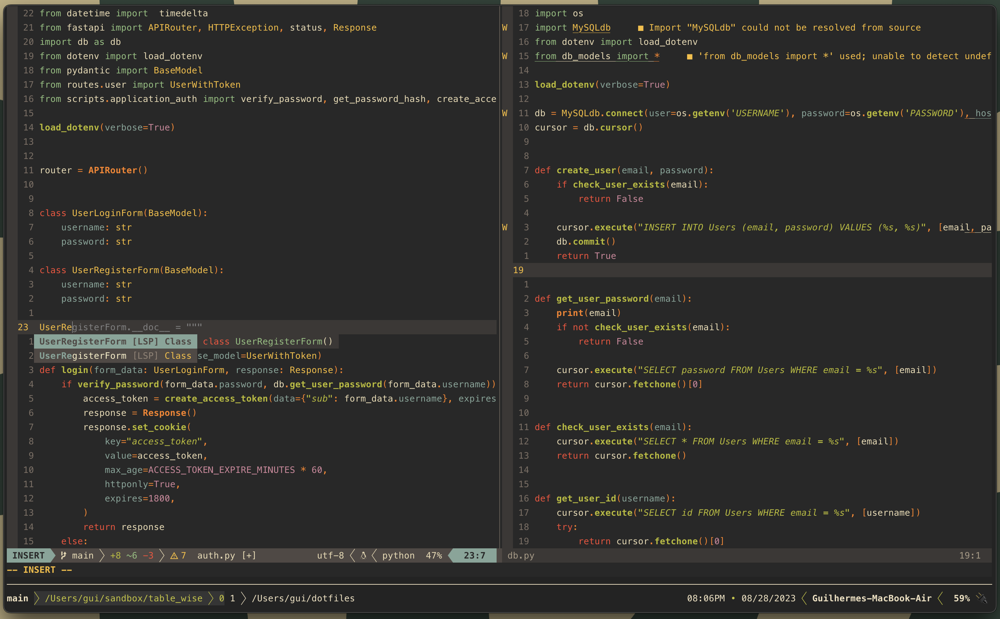

# My dotfiles

These configs are a wip and I do not recommend using them without knowing their intricacies.

## Contents

- [NeoVim Setup](#Neovim-Setup)
- [Terminal](#terminal)

## Neovim setup

This configuration is inspired by [Takuya Matsuyama](https://github.com/craftzdog/) and [ThePrimeagen](https://github.com/ThePrimeagen/)  

Requires [Neovim](https://neovim.io/) (>= 0.8)

- [wbthomason/packer.nvim](https://github.com/wbthomason/packer.nvim) - A plugin manager for Neovim
- [nvim-lualine/lualine.nvim](https://github.com/nvim-lualine/lualine.nvim) - A blazing fast and easy to configure Neovim statusline written in Lua
- [nvim-treesitter/nvim-treesitter](https://github.com/nvim-treesitter/nvim-treesitter) - Treesitter configurations and abstraction layer for Neovim
- [rose-pine/neovim](https://github.com/rose-pine/neovim) - Colorscheme for vim
- [VonHeikemen/lsp-zero.nvim] (https://github.com/VonHeikemen/lsp-zero.nvim) - A bundle of all the "boilerplate code" necessary to have nvim-cmp and nvim-lspconfig working together.
- [nvim-telescope/telescope.nvim](https://github.com/nvim-telescope/telescope.nvim) - A highly extendable fuzzy finder over lists
- [nvim-tree/nvim-tree.lua] (nhttps://github.com/vim-tree/nvim-tree.lua) - File explorer
- [github/copilot.vim] (nhttps://github.com/github/copilot.vim) - Github Copilot
- [windwp/nvim-autopairs](https://github.com/windwp/nvim-autopairs) - Autopairs
- [windwp/nvim-ts-autotag](https://github.com/windwp/nvim-ts-autotag) - Use treesitter to auto close and auto rename html tag

## Terminal

- [iterm2](https://iterm2.com/)
- [Fish shell](https://fishshell.com/)
- [bobthefish](https://github.com/oh-my-fish/theme-bobthefish/) - Theme
- [Nerd fonts](https://github.com/ryanoasis/nerd-fonts) - Powerline-patched fonts.
- [z](https://github.com/jethrokuan/z) - For jumping arround
